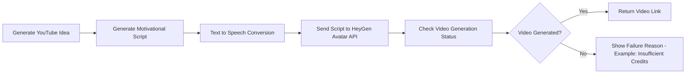

# AI Avatar Video Generator

This project demonstrates a simple **AI automation pipeline** that generates a motivational short video using multiple AI services.

The system performs the following steps automatically:

1. Generate a YouTube video idea
2. Generate a motivational script
3. Convert the script to voice
4. Send the script to HeyGen to generate an avatar video
5. Check the video generation status and print the final result

Even if the video generation fails (for example due to insufficient credits), the system continues execution and shows the reason for failure.

---

# AI Pipeline Architecture



This diagram shows how different AI services are chained together to form a **multi-step automation pipeline**.

---

# Project Workflow

The pipeline runs in the following sequence:

Step 1 → Generate YouTube Idea  
Step 2 → Generate Script  
Step 3 → Generate Voice  
Step 4 → Request Avatar Video (HeyGen API)  
Step 5 → Check Video Status  

---

# Example Run

```bash
python main.py
```

Example console output:

```text
Step 1: Generating YouTube idea...
Idea selected: Why discipline beats motivation

Step 2: Generating script prompt...
Prompt used:
Write a short motivational YouTube shorts script for the title: Why discipline beats motivation

Script generated successfully.

Step 3: Generating voice...
Voice generated successfully.
Saved to: outputs/voice.mp3

Step 4: Requesting avatar video from HeyGen...
Video request successful.
Video ID: e798d53d4e73456da173888f5491e3e7

Step 5: Checking video generation status...
Video status: waiting
Video status: processing
Video status: failed

Video generation failed.
Reason: Insufficient HeyGen credits.
```

---

# Project Structure

```
ai_avatar_video_project
│
├── main.py
├── config.py
├── youtube.py
├── script.py
├── voice.py
├── video.py
│
├── requirements.txt
├── .env
└── outputs/
```

---

# File Descriptions

## main.py
Runs the entire AI pipeline and coordinates all modules.

## youtube.py
Generates a motivational YouTube video idea.

Example idea:

```
Consistency is the real superpower
```

---

## script.py
Generates a short motivational script using the selected title.

Example script:

```
Most people wait for motivation.

But successful people rely on discipline.

Small actions repeated every day create massive success over time.
```

---

## voice.py
Converts the script into speech using the **ElevenLabs Text-to-Speech API**.

The audio file is saved locally as:

```
outputs/voice.mp3
```

---

## video.py
Handles interaction with the **HeyGen Avatar API**.

Responsibilities include:

• Sending a video generation request  
• Receiving the video ID  
• Checking video generation status  

If the account does not have credits, the system prints the failure reason.

---

# APIs Used

## ElevenLabs
Used for **Text → Speech generation**

https://elevenlabs.io

## HeyGen
Used for **AI Avatar Video Generation**

https://heygen.com

---

# Environment Setup

Create a `.env` file in the root directory.

```
HEYGEN_API_KEY=your_heygen_api_key
ELEVEN_API_KEY=your_elevenlabs_api_key
```

---

# Installation

Install the required dependencies:

```bash
pip install -r requirements.txt
```

---

# Running the Project

Run the pipeline using:

```bash
python main.py
```

---

# Output

If the HeyGen account has sufficient credits:

```
Video generated successfully
Video link: https://...
```

If credits are not available:

```
Video generation failed
Reason: Insufficient HeyGen credits
```

---

# Error Handling

The system handles several failure scenarios gracefully:

• Missing API keys  
• Network failures  
• Invalid avatar IDs  
• Insufficient HeyGen credits  

Instead of crashing, the system prints clear diagnostic messages.

---

# Learning Outcomes

This project demonstrates:

• AI API integration  
• Multi-step AI pipelines  
• Automation workflows  
• Production-style error handling  
• AI service orchestration  

---

# Author

Ashish Lahire

GitHub:  
https://github.com/AshishLahire

